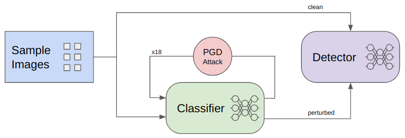
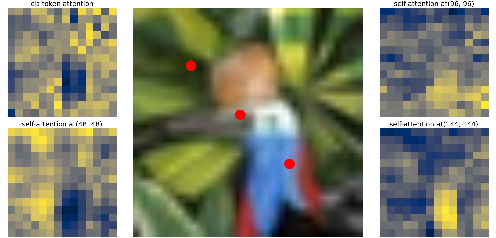
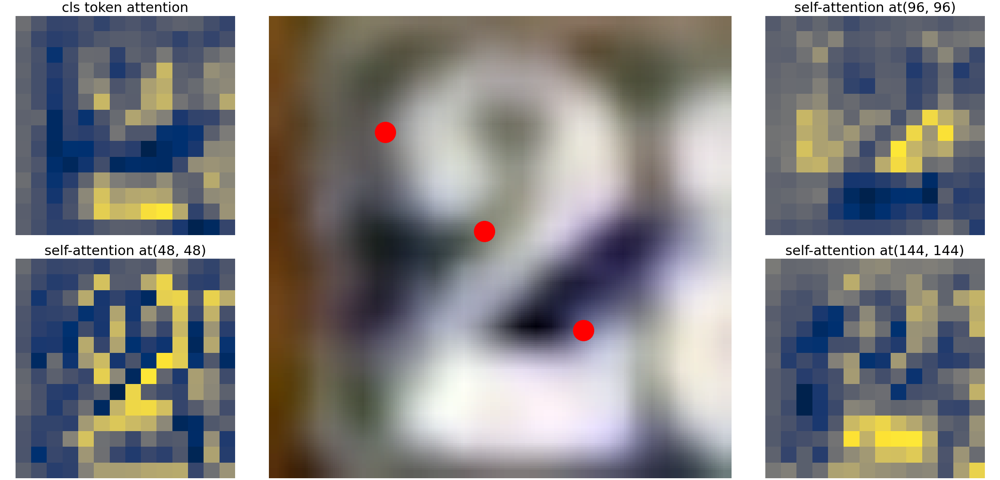

# Robust Adversarial OOD Detection with ViTs

## Installation

All required packages are frozen in the requirements.txt file.
```shell
pip install -r requirements.txt
```

#### Download Datasets
Download the [CIFAR-10](https://www.cs.toronto.edu/~kriz/cifar.html), [CIFAR-100](https://www.cs.toronto.edu/~kriz/cifar.html) and [SVHN](http://ufldl.stanford.edu/housenumbers/) datasets  
and place them in their respective directory in the ```data``` folder like so:  
```shell
data/cifar10/<place files here>
data/cifar100/<place files here>
data/svhn/<place files here>
```

#### Download Pre-Trained Models
To run the following code you have to download pre-trained models and place them in ```saved_models/pretrained/```. [CIFAR-10](https://www.cs.toronto.edu/~kriz/cifar.html), [CIFAR-100](https://www.cs.toronto.edu/~kriz/cifar.html) and [SVHN](http://ufldl.stanford.edu/housenumbers/) datasets  
The following section explains mostly the use of B16 and T16 ViT models with patch size 16 and image size 224 which can be downloaded like so:  
```shell
wget https://storage.googleapis.com/vit_models/augreg/B_16-i21k-300ep-lr_0.001-aug_medium1-wd_0.1-do_0.0-sd_0.0--imagenet2012-steps_20k-lr_0.01-res_224.npz
wget https://storage.googleapis.com/vit_models/augreg/Ti_16-i21k-300ep-lr_0.001-aug_none-wd_0.03-do_0.0-sd_0.0--imagenet2012-steps_20k-lr_0.03-res_224.npz
```
But in order to download other models refer to [the official github page](https://github.com/rwightman/pytorch-image-models/blob/main/timm/models/vision_transformer.py#L53).


# Usage

## Train a Vision Transformer Classifier

To train a ViT model with **batch size 32** on Cifar-10, Cifar-100 and SVHN respectively, execute one of the following lines:
```shell
python train_classifier.py --train-steps 95000 --model-arch b16 --image-size 224 --lr 0.01 --wd 1e-5 --n-gpu 2 --num-workers 8 --batch-size 32 --method SupCE --data-dir data/cifar10/ --dataset cifar10 --num-classes 10 --checkpoint-path saved_models/pretrained/B_16-i21k-300ep-lr_0.001-aug_medium1-wd_0.1-do_0.0-sd_0.0--imagenet2012-steps_20k-lr_0.01-res_224.npz
python train_classifier.py --train-steps 95000 --model-arch b16 --image-size 224 --lr 0.01 --wd 1e-5 --n-gpu 2 --num-workers 8 --batch-size 32 --method SupCE --data-dir data/cifar100/ --dataset cifar100 --num-classes 100 --checkpoint-path saved_models/pretrained/B_16-i21k-300ep-lr_0.001-aug_medium1-wd_0.1-do_0.0-sd_0.0--imagenet2012-steps_20k-lr_0.01-res_224.npz
python train_classifier.py --train-steps 138000 --model-arch b16 --image-size 224 --lr 0.01 --wd 1e-5 --n-gpu 2 --num-workers 8 --batch-size 32 --method SupCE --data-dir data/ --dataset svhn --num-classes 10 --checkpoint-path saved_models/pretrained/B_16-i21k-300ep-lr_0.001-aug_medium1-wd_0.1-do_0.0-sd_0.0--imagenet2012-steps_20k-lr_0.01-res_224.npz
```

The classifiers can also be trained on other batch sizes.
But the following executions will only cover batch size 32, because the machine available during development could only handle batch size 32 later on with the adversarial attack.


### Test the Classifier
One advantage of this implementation is, that all parameters are stored inside the checkpoint file, so they do not have to be specified manually.
In order to test the first classifier trained on Cifar-10 you have to execute the following command:
```shell
python test_classifier.py --model vit --n-gpu 2 --num-workers 8 --classification_ckpt saved_models/trained_classifier/vit_b16_224SupCE_cifar10_bs32_best_accuracy.pth
```
The ```--classification_ckpt``` eventually has to be adapted to the location where your trained classifier is located.
By default the trained classifier gets placed in the ```saved_models/trained_classifier/``` directory.


## Train an OOD Detector
| :warning: WARNING: Executing the commands of the detector takes a lot of time! :warning: |
|------------------------------------------------------------------------------------------|

Training a ViT detector takes an already trained classifier into account, as the PGD attack is performed on the gradients of the classifier.
The following command trains a tiny ViT model with batch size 32 on cifar10 as ID data and SVHN as OOD data **for only 2 epochs**.
If more epochs are desired, just increase the ```--train-steps``` argument. 3125 training steps are equal to one epoch for batch size 32.
Training 1 epoch took ~16h plus ~2h of validation on the machine used for development.
Both datasets also get perturbed x times by the PGD attack according to the gradients of the classifier [here: x = (restarts+1) * (iterations+1)]
```shell
python train_detector --train-steps 6250 --model vit --model-arch t16 --image-size 224 --data-dir data/cifar10/ --dataset cifar10 --ood-data-dir data/ --ood-dataset svhn --lr 0.01 --wd 1e-5 --device cuda --select-gpu 0 --num-workers 8 --batch-size 32 --method SupCE --attack --noise normal --iterations 5 --restarts 2 --checkpoint-path saved_models/pretrained/Ti_16-i21k-300ep-lr_0.001-aug_none-wd_0.03-do_0.0-sd_0.0--imagenet2012-steps_20k-lr_0.03-res_224.npz --classifier-ckpt-path saved_models/trained_classifier/vit_b16_224SupCE_cifar10_bs32_best_accuracy.pth
```
> :warning: Training a detector model is **VERY** slow, as the input samples run through the classifier multiple times (= restarts+1 * iterations+1) to find an optimal perturbation.
> 1 epoch takes ~18h on the machine used for development!!

In case the paths and the trained models have not been changed yet, the paths should work as they are in the command above.
By default the trained detector gets placed in the ```saved_models/trained_detector/``` directory.
The attack has 18 cycles for 2 restarts and 5 iterations $[18 = (2+1) * (5+1)]$.




### Test the OOD Detector
Again, testing the OOD detector is rather argument poor, as all the arguments are stored inside the checkpoint files and do not have to be specified manually.
```shell
python test_detector.py --model vit --attack --device cuda --select-gpu 0 --num-workers 8 --classification-ckpt saved_models/trained_classifier/vit_b16_224SupCE_cifar10_bs32_best_accuracy.pth --detector-ckpt-path saved_models/trained_detector/vit_t16_224SupCE_id_cifar10_ood_svhn_bs32_best_accuracy.pth
```
> :warning: Testing a detector model is again on the slower side, as the input samples have to run through the classifier multiple times again to ensure robustness.
> Testing the detector takes as much time as training it for 1 epoch.

In case the paths and the trained models have not been changed yet, the paths should work as they are in the command above. The specified ID dataset is Cifar10 and the OOD dataset is SVHN in the command above.


## Visualize the Attention Results
Visualize the attention maps of 4 randomly selected samples from the first 4 batches (the --visualize parameter is zero-indexed).
```shell
python visualize_detector_attention.py --model vit --attack --device cuda --select-gpu 1 --num-workers 8 --visualize 3 --classification-ckpt saved_models/trained_classifier/vit_b16_224SupCE_cifar10_bs32_best_accuracy.pth --detector-ckpt-path saved_models/trained_detector/vit_t16_224SupCE_id_cifar10_ood_svhn_bs32_best_accuracy.pth
```

In case the paths and the trained models have not been changed yet, the paths should work as they are in the command above. The specified ID dataset is Cifar10 and the OOD dataset is SVHN in the command above.


*ID Cifar10 first attention layer of a clean image of a bird.*


*OOD SVHN 8th attention layer of a perturbed image of the digit 2.*

To print the path an OOD image takes to get closer to an ID image can be done with the following command:
(Note: a random image from the first OOD batch is selected)
```shell
python visualize_detector_attention.py --model vit --attack --print-perturbation-path --device cuda --select-gpu 1 --num-workers 8 --visualize 0 --classification-ckpt saved_models/trained_classifier/vit_b16_224SupCE_cifar10_bs32_best_accuracy.pth --detector-ckpt-path saved_models/trained_detector/vit_t16_224SupCE_id_cifar10_ood_svhn_bs32_best_accuracy.pth
```


To visualize an ID sample of the corresponding class the following command has to be executed and the **specific label has to be adjusted**:
```shell
python visualize_detector_attention.py --model vit --attack --print-specific-id-label --specific-label <LABEL> --device cuda --select-gpu 1 --num-workers 8 --visualize 32 --classification-ckpt saved_models/trained_classifier/vit_b16_224SupCE_cifar10_bs32_best_accuracy.pth --detector-ckpt-path saved_models/trained_detector/vit_t16_224SupCE_id_cifar10_ood_svhn_bs32_best_accuracy.pth
```

The command above automatically cancels execution once a single ID sample from the same class was found and visualized.


## EXPERIMENTAL

#### Try out the Monotone PGD attack with visualization
Simply run the default python script, no parameters are necessary:
```shell
python run_MPGD_attack.py
```
Additional parameters can be specified if necessary. They can be found at the top of the `run_MPGD_attack.py` file.
This might look like the following:
```shell
python run_MPGD_attack.py --single --eps 0.025 --iterations 25 --visualize
```


## Acknowledgments
This code is inspired by the works of [Rajat Koner](https://github.com/rajatkoner08/oodformer) and [Alexander Meinke](https://github.com/AlexMeinke/Provable-OOD-Detection).
